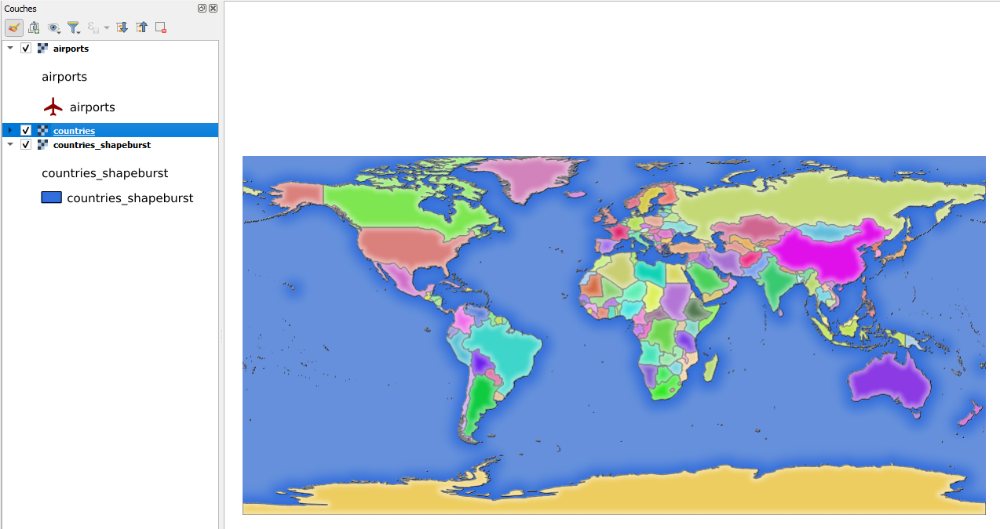

## Installation de QGIS Server sur WSL !

Aujourd'hui on publie des données avec QGIS Server. :earth_africa: 	


+

+


<!--logos WSL + Debian + QGIS Server depuis github-->

Documentation fortement inspirée de la documentation officielle de QGIS.org

https://docs.qgis.org/3.40/fr/docs/server_manual/getting_started.html#installation-on-debian-based-systems

## Pré-requis

Avoir activer WSL et installer un terminal Debian ou Ubuntu (cf votre version windows)

## Pourquoi

- Pour la préparation d'un cours sur QGIS server
- Pour la curiosité tout court
- Pour se passer de la version OSGEO4W et de la méthode 
(https://docs.qgis.org/3.40/fr/docs/server_manual/getting_started.html#installation-on-windows)


## Procédure

### Côté WSL depuis un terminal Debian ou Ubuntu

*Adapter les noms si souhaité, ou changer "thomas" sauf si vous voulez porter ce prénom magnifique l'instant de cette démo*

- Actualisation du gestionnaire de paquets

sudo apt update

- Installation pré-requis

  ``sudo apt install gnupg software-properties-common``

- Ajout de la clé gpg 

  ``sudo wget -O /etc/apt/keyrings/qgis-archive-keyring.gpg https://download.qgis.org/downloads/qgis-archive-keyring.gpg``

- Connaître le nom de son système (Debain & Ubuntu)

  ``lsb_release -cs``

- Création du fichier qgis.ressources avec touch (ficheri qui permet d'indiquer la version qu'on cherche à installer)

  ``sudo touch /etc/apt/sources.list.d/qgis.sources``
  
- Edition de qgis.ressources car il est vide pour le moment

  ``sudo nano /etc/apt/sources.list.d/qgis.sources``
  
> On copie/colle le contenu dans le fichier
  
```
	Types: deb deb-src 
	URIs: https://qgis.org/debian-ltr
	Suites: bookworm #debian
	Architectures: amd64
	Components: main
	Signed-By: /etc/apt/keyrings/qgis-archive-keyring.gpg
```


- On rafraîchi à nouveau le gestionnaire de paquet puisqu'on vient de rajouter les éléments précédents

  ``sudo apt update``

- On installe qgis-server (cf doc qui installe aussi qgis, on considère ici qu'il est déjà installé sur la machine client windows)

  ``sudo apt install qgis-server``

- On vérifie si le serveur est installé
  
  ``/usr/lib/cgi-bin/qgis_mapserv.fcgi``
  
> Si on obtient une sortie de ce type, c'est que le serveur est correctement installé.

``` 
QStandardPaths: wrong permissions on runtime directory /mnt/wslg/runtime-dir, 0777 instead of 0700
Warning 1: Unable to find driver ECW to unload from GDAL_SKIP environment variable.
Warning 1: Unable to find driver ECW to unload from GDAL_SKIP environment variable.
Warning 1: Unable to find driver JP2ECW to unload from GDAL_SKIP environment variable.
"Loading native module /usr/lib/qgis/server/liblandingpage.so"
"Loading native module /usr/lib/qgis/server/libwcs.so"
"Loading native module /usr/lib/qgis/server/libwfs.so"
"Loading native module /usr/lib/qgis/server/libwfs3.so"
"Loading native module /usr/lib/qgis/server/libwms.so"
"Loading native module /usr/lib/qgis/server/libwmts.so"
Content-Length: 0
Location: http:/index.json
Server:  QGIS FCGI server - QGIS version 3.40.5-Bratislava
Status:  302
``` 

- Suite de la doc avec la création des dossiers

  ``cd /home/``

  ``sudo mkdir qgis/``

  ``sudo mkdir qgis/projets``
  
  ``cd qgis/projets``
  
  ``sudo chown www-data:www-data -R /home/qgis/*``
  
  ``sudo chmod a+w -R /home/qgis/*``
  
- Récupération des données pour la démo (prout) 
  
  ``wget https://github.com/qgis/QGIS-Training-Data/archive/release_3.40.zip``
  ``unzip release_3.40.zip``
  
  ``mv QGIS-Training-Data-release_3.40/exercise_data/qgis-server-tutorial-data/world.qgs .``
  
  ``mv QGIS-Training-Data-release_3.40/exercise_data/qgis-server-tutorial-data/naturalearth.sqlite .``
  
  ``rm -R release_3.40.zip``
   
- Installation du web serveur Apache

  ``sudo apt install apache2 libapache2-mod-fcgid``

- Configuration du serveur pour qu'il point vers qgis Server

  ``sudo touch /etc/apache2/sites-available/thomas.demo.conf``
  
- On édite avec nano et on colle le contenu dans le dossier

  ``sudo nano /etc/apache2/sites-available/thomas.demo.conf``

````
<VirtualHost *:80>
  ServerAdmin webmaster@localhost
  ServerName thomas.demo

  DocumentRoot /var/www/html

  # Apache logs (different than QGIS Server log)
  ErrorLog ${APACHE_LOG_DIR}/thomas.demo.error.log
  CustomLog ${APACHE_LOG_DIR}/thomas.demo.access.log combined

  # Longer timeout for WPS... default = 40
  FcgidIOTimeout 120

  FcgidInitialEnv LC_ALL "en_US.UTF-8"
  FcgidInitialEnv PYTHONIOENCODING UTF-8
  FcgidInitialEnv LANG "en_US.UTF-8"

  # QGIS log
  FcgidInitialEnv QGIS_SERVER_LOG_STDERR 1
  FcgidInitialEnv QGIS_SERVER_LOG_LEVEL 0

  # default QGIS project
  SetEnv QGIS_PROJECT_FILE /home/qgis/projets/world.qgs

  # QGIS_AUTH_DB_DIR_PATH must lead to a directory writeable by the Server's FCGI process user
  FcgidInitialEnv QGIS_AUTH_DB_DIR_PATH "/home/qgis/qgisserverdb/"
  FcgidInitialEnv QGIS_AUTH_PASSWORD_FILE "/home/qgis/qgisserverdb/qgis-auth.db"

  # Set pg access via pg_service file
  SetEnv PGSERVICEFILE /home/qgis/.pg_service.conf
  FcgidInitialEnv PGPASSFILE "/home/qgis/.pgpass"

  # if qgis-server is installed from packages in debian based distros this is usually /usr/lib/cgi-bin/
  # run "locate qgis_mapserv.fcgi" if you don't know where qgis_mapserv.fcgi is
  ScriptAlias /cgi-bin/ /usr/lib/cgi-bin/
  <Directory "/usr/lib/cgi-bin/">
    AllowOverride None
    Options +ExecCGI -MultiViews -SymLinksIfOwnerMatch
    Require all granted
  </Directory>

  <IfModule mod_fcgid.c>
  FcgidMaxRequestLen 26214400
  FcgidConnectTimeout 60
  </IfModule>

</VirtualHost>
````

- Création des répertoires qui stockeront les logs du serveur QGIS et ceux de la base de données d’authentification :

  ``mkdir -p /var/log/qgis/`` 
  
  ``sudo mkdir -p /var/log/qgis/``

  ``chown www-data:www-data /var/log/qgis``

  ``sudo chown www-data:www-data /var/log/qgis``
  
  ``sudo mkdir -p /home/qgis/qgisserverdb``
  
- Accord des droits à l'utilisateur Aapche www-data
  
  ``sudo chown www-data:www-data /home/qgis/qgisserverdb``
  
- Activation de l’hôte virtuel et le module fcgi
  
  ``a2enmod fcgid``
  
  ``sudo a2enmod rewrite``
  
  ``sudo a2ensite thomas.demo``

- Redémarrer Apache pour prendre en compte la personnalisation du Server

  ``sudo service apache2 reload``
  
> ça semble correct niveau wsl

On va maintenant configurer le windows client pour que l'url "thomas.demo" renvoie vers le serveur qgis serveur que nous venons d'installer  sur WSL

Il faut relever l'adresse IP de l'interface réseau de WSL depuis Debian (ou Ubuntu)
  
   ``ip a``
````
1: lo: <LOOPBACK,UP,LOWER_UP> mtu 65536 qdisc noqueue state UNKNOWN group default qlen 1000
    link/loopback 00:00:00:00:00:00 brd 00:00:00:00:00:00
    inet 127.0.0.1/8 scope host lo
       valid_lft forever preferred_lft forever
    inet6 ::1/128 scope host
       valid_lft forever preferred_lft forever
2: eth0: <BROADCAST,MULTICAST,UP,LOWER_UP> mtu 1500 qdisc mq state UP group default qlen 1000
    link/ether 00:15:5d:a9:36:97 brd ff:ff:ff:ff:ff:ff
    inet 172.17.213.77/20 brd 172.17.223.255 scope global eth0
       valid_lft forever preferred_lft forever
    inet6 fe80::215:5dff:fea9:3697/64 scope link
       valid_lft forever preferred_lft forever
````
 
Pour windows, localhost correspond à 127.0.0.1, il voit donc ici WSL sur l'IP **172.17.213.77**
 
### Côté client windows


Par l'explorateur de fichier, se rendre dans `C:\Windows\System32\drivers\etc` pour modifier le fichier `hosts`.

> [!NOTE]
> Il faut modifier ce fichier en tant qu'administrateur.

Ajouter la ligne suivante à la fin du fichier

`` 172.17.213.77 thomas.demo ``
 
### Résultat

> Dans un navigateur

La requête doit renvoyer le xml du GetCapabilities 

http://thomas.demo/cgi-bin/qgis_mapserv.fcgi?SERVICE=WMS&VERSION=1.3.0&REQUEST=GetCapabilities


> Ouvrir le ~~projet~~ webservice dans QGIS   

~~pas gagné avec le sqlite ou bien parce que c'est sur un emplacement \\wsl.localhost !!~~
Visiblement, QGIS galère pour charger le sqlite qui n'est pas sur un emplacement windows

Le webservices lui fonctionne parfaitement (ajouter le GetCapabilities au service WMS)



:beers:

